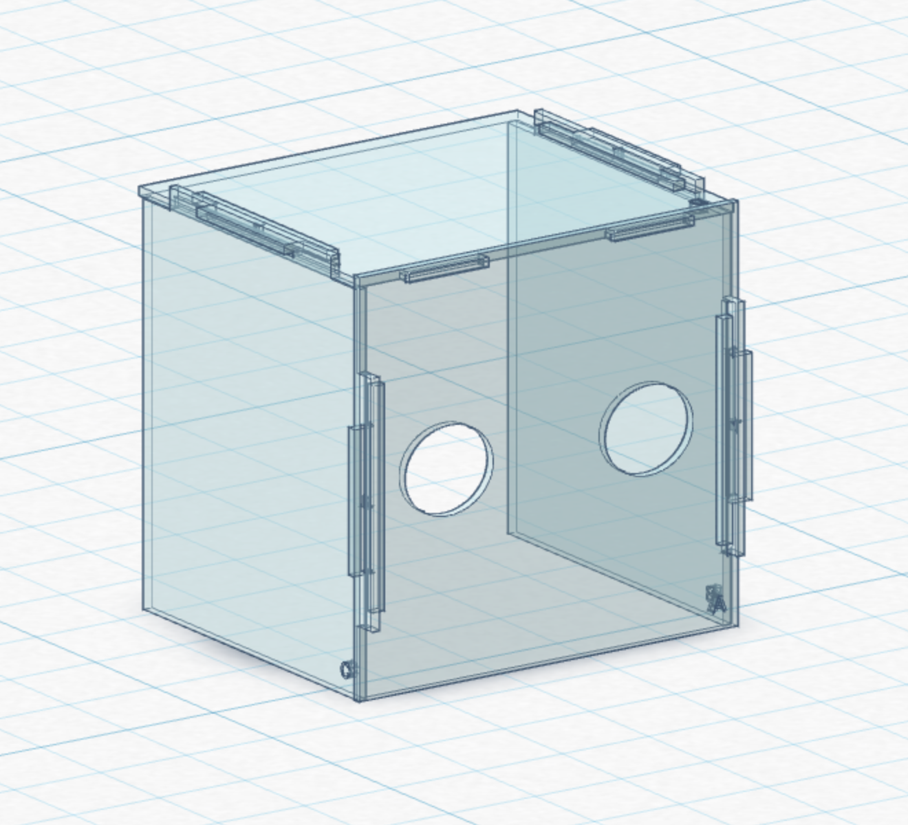

# Collapsible Intubation Box

A fully open design for collapsible, no-glue aerosol/intubation boxes designed for use during the COVID-19 crisis (and beyond).

## Getting the design

You can download the latest version of everything from [the releases page](https://github.com/jm/collasible_intubation_box/releases).

Or you can optionally clone this repository:

    git clone https://github.com/jm/collapsible_intubation_box.git

This will give you local copies of everything.

## What is an intubation box?

Intubation boxes (or aerosol boxes) provide an extra barrier between a medical worker and a patient when performing endotracheal intubation.  This box is designed to protect both parties from aerosol contamination as currently this is a particularly high risk procedure when carried out in a non-negative pressure environments, especially in places like improvised field hospital units as we see setup in several locations during our current COVID-19 crisis.

The original design was described by Taiwainese doctor Dr. Lai Hsien-Yung, but I have made several modifications to his design and created immediately usable design files.

### Why does this design need to exist?

All other open designs I could find were either pretty complicated and required the use of a larger CNC machine or thermoforming setup, which requires expertise and, usually, expense.  They were also glued together, which means they are expensive to ship, bulky to store, and can't be collapsed for carrying and use in environments such as ambulances.  This design is meant to solve those issues.

Likewise, most of the designs fabricated as shown cost approximately $175 to $300, but this design can be fabricated for about $40-$100 depending on where you acquire the materials.

## The general bill of materials

In general you'll need two things:

* A laser cutter or CNC with a bed that can cut at least 20" x 20"
* About 80" x 20" of acrylic or polycarbonate materials (this design is scaled for 1/4" or 6mm thick material).  It's about 11.5 square feet or just over 1 square meter of material.  Most suppliers can get you 4 ft. x 8 ft. sheets easily or 24" x 24" at a minimum.  You can get two boxes (with some extra space) from a single 4x8' sheet, which cost about $90 at my local supplier.

## Assembly

_There is a PDF with assembly instructions in the release download, but I'm providing the instructions here also for reference._

Each piece has a letter label, so you'll want to locate that for assembly.

1. Take Panel D, which is the top of the box, and slot to top of each Panel B and Panel C into it.

2. Take a t-brace (labeled "T") and slot it into the slot sticking up on top of Panel B and Panel C to create a tight joint.  Preferably, the wider part of the t-brace should be to the inside of panel C rather than towards the exposed edge.

3. Take Panel A (the front panel with arm holes) and slot it on to the structure with the two non-braced slots at the top and each Panel B and Panel C slotting into their respective sides.

4. Repeat the t-bracing process, with the wider potion of the t-brace to the inside of Panel A.

5. Intubate at will.

## What do I need to get a box in my hands?

You have two options: have one fabricated for you or facilitate the fabrication yourself.

### If you need to have boxes produced for you

Getting a box fabricated for your facility probably won't be an issue since a lot of people have the means to help and are eager to do so.

#### Locating a local fabrication partner

To locate a local fabrication partner, look around for places that likely have a laser cutter or CNC.  These could be:

* Makerspaces
* Libraries (many of them have makerspaces in them these days)
* Sign shops

Simply contact them and ask if they are willing to help out.  I would imagine in most cases you can get them produced for free or very cheap, especially if you provide materials (see the bill of materials for the version you're using for what you'll need).  If you find another type of business that's willing to help out, file a pull request so I can add it here!

#### Having trouble? Let's see if we can help

Go to [the Issues section](https://github.com/jm/open_intubation_box/issues) of this repository and [file a new issue](https://github.com/jm/open_intubation_box/issues/new) with your contact information, location, and how many boxes you'd need in the description.  I'm going to encourage people to look there for places to help with their needs.

### If you want to produce your own

Producing your own is not terribly difficult.  The provided SVG files should load into any laser cutter or CNC with no more work than most other files.  If you have any problems, do [file an Issue](https://github.com/jm/collapsible_intubation_box/issues/new)!  After you get it all setup/loaded in, let the machine cut the pieces, snap them together, and voila!  (It may be slightly more difficult than it sounds, but trust me, not horrible!)

_If you're looking to produce boxes for hospitals, check [the Issues section here](https://github.com/jm/open_intubation_box/issues) for people looking for them.  Otherwise, contact one of the many organizations who are collecting supplies for hospitals or hospitals directly for more information._

## Support
 
If you need any adjustments to the design, please [file an Issue](https://github.com/jm/collapsible_intubation_box/issues/new), and I will do my best (or perhaps someone else will volunteer!) to address it.  Even if you just need some customization (e.g., to fit your unit's beds or for a particularly large patient or whatever), please do feel free to file issues.

If you want to improve on this somehow or suggest changes, feel free to fork it and file pull requests.  Even if I don't accept the PR into the mainline branch, I'll link your version if I think it's useful!
